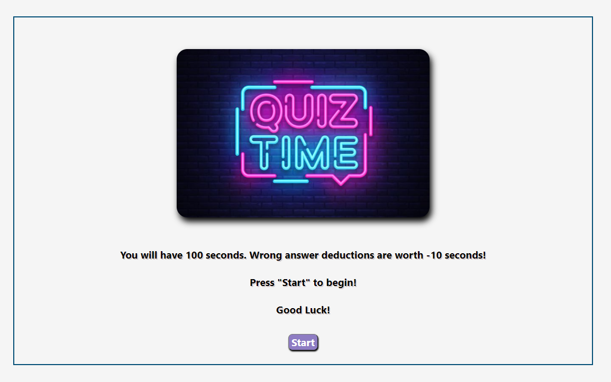

# Coding Quiz
## Description

This application is intended to test the user of their knowledge of coding in a timed manner. The application saves, retains, and displays high scores.

## Installation
* None
## Usage
This repository can be opened as an HTML within Github at the website: https://teeemster.github.io/timed-quiz/

The user presses start to begin the quiz. Clicking the correct answer button will result in a green highlight. Clicking the incorrect answer button will result in a red highlight. Wrong answer deductions will subtract ten seconds from the clock. At the end, the user's score is saved and displayed. The user can then click a button to either clear all prior high scores or restart the quiz.

    
## Credits
* Jonathan Beach
## License
* 

## Badges
  
* 
* 
* 